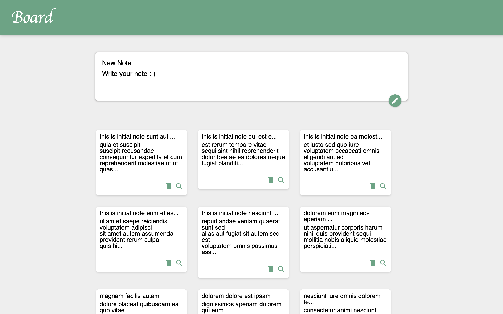

## Memo Board With Next.js



### Project example image

---

## How to Run?

```bash
npm i
# or
yarn

npm run dev
# or
yarn dev
```

Open [http://localhost:3000](http://localhost:3000) with your browser to see the result.
